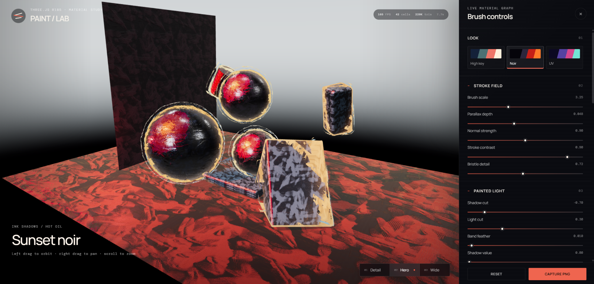
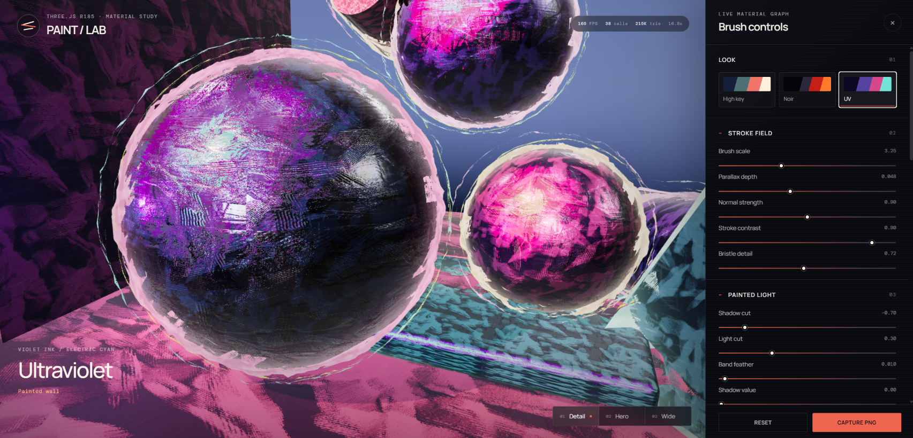

# Three.js Stylized Paint Shader

An interactive Three.js port and extension of Gabriel de Laubier's
[Stylized Paint Shader Breakdown](https://cyn-prod.com/stylized-paint-shader-breakdown).
The demo is pinned to **Three.js 0.185.1**.



*Sunset Noir — the full interactive material laboratory and brush controls.*



*Ultraviolet — close-up brush texture, painted reflections, and broken outlines.*

## Run

```bash
corepack pnpm install
corepack pnpm run dev
```

Build the production bundle with:

```bash
corepack pnpm run build
```

## Scenes

Use the **Active scene** dropdown beneath the Paint/Lab mark to switch between:

- Material study — the original primitive shader laboratory.
- Texture study — a ground-only comparison using the approved meadow, dense
  grass, dry grass, and under-forest leaf-litter maps from
  `medieval-road-system`. The four albedo, normal, roughness, and AO identities
  are blended before the painterly response, with Verdant as the authored
  starting look.
- Tier 1 residence — the burgage cottage integration from
  `medieval-road-system`.
- SeedThree beech — one deterministic American beech (*Fagus grandifolia*)
  generated from the exact SeloSlav/SeedThree fork and preset used by
  `medieval-road-system`, then rendered through the painterly bark, leaf-cutout,
  outline, and stylized-shadow paths.
- CC0 man — the rigged Quaternius villager copied from `medieval-road-system`,
  centered as a standalone material test with all nine authored clothing, skin,
  hair, and eye colors routed through the painterly shader. Its idle clip remains
  active and obeys the lab's Freeze time control.

SeedThree is pinned to commit `4c20609db11f99605018e94cf7833351692d569a`.
The lab preserves its seeded Weber–Penn skeleton and branch mesher. Its LOD0
leaf grammar is baked into one ordinary mesh so the same WebGL painterly
material lifecycle can own all 2,712 leaf instances without mixing Three.js
runtime entries.

## Ported material graph

The visible paint and lighting graph stays local to each object. The simple
material-study forms keep their original painterly outline shells; imported
and highly tessellated assets use a bounded silhouette-mask equivalent so
outline shape is independent of mesh density and triangle size.

- One deterministic RGBA texture owns the complete paint field:
  - **RG** — tangent-space brush normal X/Y, decoded from `[0, 1]` to
    `[-1, 1]` with the tutorial's fixed `Z = 0.95` approximation. Every broad
    deposited mark carries its own strongly randomized tilt; a weaker
    height-derived bristle normal is layered over it.
  - **B** — broad grayscale strokes for the two-color diffuse gradient and
    bump-offset/parallax height.
  - **A** — smaller high-contrast strokes for bristle tips and band breakup.
    Edge and shadow masks combine it with the broad B carrier instead of using
    detail noise as a silhouette by itself.
- The reset lighting thresholds reproduce the tutorial's `0 / .25 / 1`
  sun bands (`N·L` cuts at approximately `-.7` and `.3`).
- The reflected view vector is compared directly with the light, matching the
  tutorial's fake-reflection mechanism. A stylized expansion turns that signal
  into broad, quantized coral/orange paint planes; rotated RG normals, B-load,
  and A-bristles break the plane into authored marks. Near-white impasto is a
  smaller brush-loaded peak, not the entire light lobe.
- The matte diffuse palette owns the main color separation. Setting Oil
  reflection and Native sheen to zero therefore leaves colorful coral, magenta,
  and navy paint masses instead of collapsing the object to black; oil is an
  optional glaze rather than a metalness substitute.
- Smooth normals are stored in a dedicated geometry attribute. They drive
  curvature detection and stable edge handling without losing hard surface
  normals.
- The solid pass uses a shared triplanar B/A edge field and derivative
  curvature to keep shallow flat faces while dry gaps remove paint from curved
  silhouettes. A low-frequency comb sets the reach and a finer comb frays the
  tips; both remain clamped to a shallow edge band.
- The material-study forms retain the original attached rim and two asymmetric
  shell loops. Complex assets contribute their unchanged visible silhouette to
  three bounded mask roles with the same colors and breakup. Their mask stores
  object-space triplanar brush load and carries it into nearby outline pixels,
  preserving the hand-drawn character without inflating model triangles.
- Outline reach follows the perspective scale of the model, so zooming does
  not make the stroke proportionally thinner. Occluded mask edges contribute
  zero alpha and cannot show through foreground surfaces.
- Complex multi-part assets can contribute a shared outline group. The mask
  then follows the visible union of the complete asset instead of losing its
  silhouette when unoutlined trim occludes a selected wall or roof panel.
- The custom depth pass overrides opacity with the same triplanar B/A carrier
  and comb used by the edges, but with an independent phase, scale, cutoff, and
  erosion amount. Squared light-facing response makes the breakup pronounced
  on curved casters while a derivative guard preserves shallow flat faces.
- Curved and rounded objects triplanar-project the macro B/A field to avoid
  sphere pole pinching. Fine tangent-space relief retains the tutorial's UV
  path.
- Deforming meshes evaluate procedural paint, rim breakup, and shadow breakup
  from their undeformed surface coordinates. Those fields interpolate like
  permanent texture coordinates and bend with the skin instead of behaving as
  a rigid projector volume during animation.
- Three.js ACES tone mapping is the single output transform. When a complex
  asset is active, the composer owns only its rim/outline masks and output
  conversion; there is no bloom, screen-space paint filter, or second tone-map.
- The Texture study resolves four direct texture-backed terrain identities in
  world space. Three grass layers use decorrelated scales and rotations; the
  forest-litter layer uses a smaller world scale. One deterministic broad field
  owns the albedo, tangent normal, roughness, and AO blend weights before the
  painterly bands and brush relief are applied.

## Controls and diagnostics

The panel groups parameters by perceptual role: stroke scale/relief, painted
light, oil response, bristle reach, rim continuity, outline width variation,
and a separate stylized-shadow group. It also
provides:

- High Key, Sunset Noir, Ultraviolet, Earthy, Open Sky, and Verdant
  art-direction presets.
- Detail, Hero, and Wide fixed camera bookmarks (`1`, `2`, `3`).
- True-zero rim/outline widths plus independent live color pickers for the
  primary and secondary painterly loops.
- Final, packed-normal, broad-stroke, detail-stroke, toon-band, oil-only,
  impasto-highlight, erosion-only, shadow-mask, color-coded edge-layer, and
  source-albedo views.
- Texture weights view, color-coding the four deterministic terrain identities
  in the Texture study scene.
- Deterministic field shuffle/reset, time freeze (`P`), quality tiers, PNG
  capture, and versioned JSON settings export.
- In the Material study scene, click any painted object to attach a transform
  gizmo. Drag its handles directly, use `W` / `E` / `R` for move / rotate /
  scale, and press `Esc` or click empty space to close it.
- Live FPS, draw-call, and triangle counters.

`Reset` restores seed `73021`, all shader values, object transforms, the Noir
preset, the Hero camera, and freezes motion at `t = 0` for reproducible captures.

## Exporting a material setup

`Export JSON` downloads every slider-backed uniform under `controls`, plus the
active look palettes, scene metadata, Three.js revision, and deterministic
packed-texture recipe. The reusable part is deliberately independent of the
Lab DOM. Rebuild the packed field and apply the numeric controls directly:

```ts
import {
  applyPainterlyControls,
  createPaintGlobalUniforms,
  createPainterlyMaterial,
} from './PainterlyMaterial.ts';
import { createPaintTexture } from './paintTexture.ts';
import exported from './paint-lab-tier-one-residence-noir.json';

const packed = createPaintTexture({
  size: exported.paintTexture.width,
  seed: exported.paintTexture.seed,
  broadStrokeCount: exported.paintTexture.broadStrokeCount,
  detailStrokeCount: exported.paintTexture.detailStrokeCount,
  bristleDensity: exported.paintTexture.bristleDensity,
  normalStrength: exported.paintTexture.normalStrength,
});
const paintGlobals = createPaintGlobalUniforms(packed.texture);
applyPainterlyControls(paintGlobals, exported.controls);

const material = createPainterlyMaterial(paintGlobals, {
  palette: exported.look.palettes[0],
  surfaceColor: '#b98c67',
  surfaceMap: yourObjectAlbedo,
  surfaceMapStrength: 1,
  sourceAlbedoWeight: 1,
});
```

Materials that receive the same `paintGlobals` update together. Create a
separate globals object when one mesh needs its own independently tuned setup.

## Visual contract

The target design frame preserves these observable invariants:

- Broad painted color islands, dry-brush breakup, and fine bristles remain
  simultaneously readable on the hero sphere.
- The warm reflection field ends in dragged, irregular stroke edges rather
  than a smooth PBR highlight.
- With Oil reflection and Native sheen at zero, the hero sphere still carries
  bright matte pigment islands and reads as paint rather than dark metal.
- Near-black masses survive without bloom or presentation effects.
- Strokes remain attached under object and camera motion; curved macro fields
  do not show a visible UV pole.
- Flat faces remain intact while curved silhouettes can erode.
- Rim marks stay rooted at the object boundary and taper only at their outer
  tips; erosion never exposes a deep interior or far hull.
- Both anchored loops remain readable as imperfect hand-drawn arcs: each path
  grows outward from the model, visibly swells, tapers, and dry-breaks instead
  of translating away from the silhouette or becoming a uniform wire.
- Cast-shadow footprints retain solid contact cores but break into stable
  object-locked brush marks toward curved caster silhouettes.
- The material image is unfiltered; only its object-space-authored silhouette
  fields are extended into the bounded outline composite.
- The material reads at the Detail, Hero, and Wide bookmarks and at mobile
  widths.

## Deliberate engine divergence

The UE tutorial's optional mesh-distance-field AO has no direct equivalent in
core Three.js. This demo keeps native diffuse lighting and shadow maps, while
the visible reflection is owned by a palette-tinted painterly plate rather
than a stacked GGX/clearcoat response. The optional Native sheen control can
blend a small amount of the physical response back in. It does not add
screen-space AO because that would violate the source project's
material-local paint constraint. The rest of the material stages are
exposed and independently inspectable.

## License

Released under the [MIT License](LICENSE). SeedThree code and beech texture
assets are also MIT licensed. The Quaternius man is CC0 1.0; see
[Third-party notices](THIRD_PARTY_NOTICES.md).
