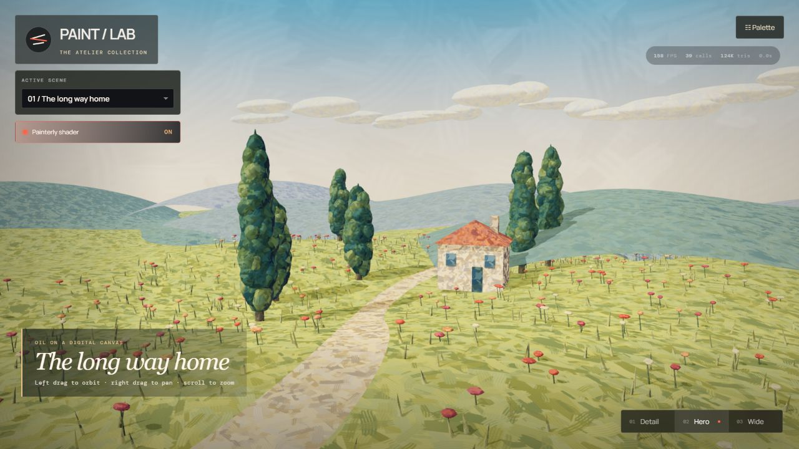
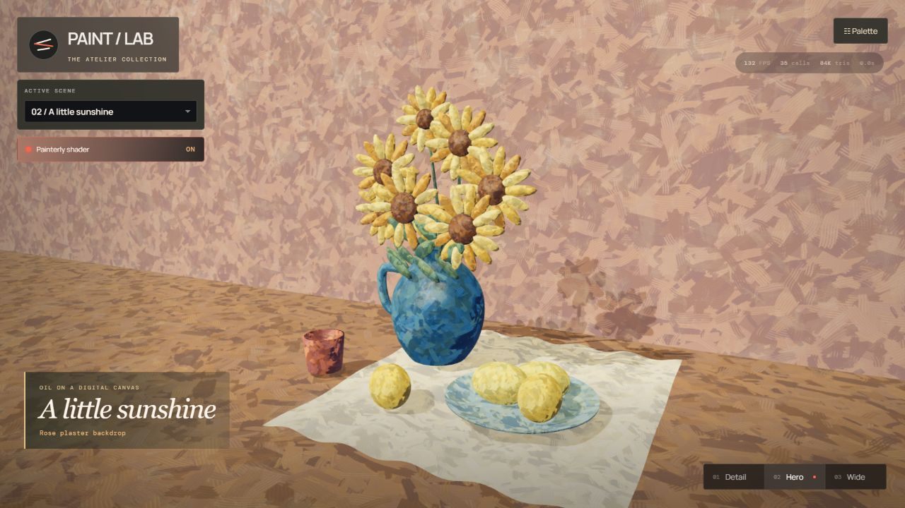

# Paint / Lab — The Atelier Collection

Six little worlds made of brushstrokes, built with **Three.js 0.185.1**.
An interactive port and extension of Gabriel de Laubier’s
[Stylized Paint Shader Breakdown](https://cyn-prod.com/stylized-paint-shader-breakdown).

## The collection

| Painting | The story | Direct link |
| --- | --- | --- |
| 01 / The long way home | Cypresses, poppies, a farmhouse, and a winding Provençal path. | `?scene=provence` |
| 02 / A little sunshine | Sunflowers, ultramarine pottery, lemons, and linen. | `?scene=still-life` |
| 03 / One more espresso | Golden café windows in a blue night. The last customer is a cat. | `?scene=night-cafe` |
| 04 / The admiral’s day off | A rubber-duck captain commands a claw-foot bathtub fleet. | `?scene=duck-admiral` |
| 05 / The crumb committee | Three pigeons hold a rooftop board meeting over one croissant. | `?scene=pigeon-meeting` |
| 06 / The grand snail prix | A garden race with a maximum speed of “eventually.” | `?scene=snail-race` |

The previous material, texture, tree, residence, and character studies have been
removed, along with their model/texture downloads and the SeedThree dependency.
Every current scene is procedural and deterministic. Signs are local canvas
textures; the scenes need no downloaded models or image assets.




## Run

```bash
corepack pnpm install
corepack pnpm dev
corepack pnpm build
corepack pnpm run test:paint
```

The development gallery runs at `http://127.0.0.1:5174`.

## Explore and paint

Use the collection selector or its previous/next buttons to browse. The URL
tracks the painting so refresh and shared links retain the scene. Drag to orbit,
right-drag to pan, and scroll to zoom. **Detail / Hero / Wide** (`1`, `2`, `3`)
restore authored compositions.

Open **Palette** for **Impasto**, **Gouache**, and **Soft study** treatments,
plus painterliness, pigment variation, relief, brush scale, lighting, and shadow
controls. Toggle **Painterly shader** to compare the native materials. The
palette starts collapsed on small screens, and the camera preserves horizontal
framing in portrait layouts.

**Reset** restores the current painting’s values, lighting, seed `73021`,
transforms, and Hero camera, then freezes time. **Shuffle field** changes the
paint deposits without changing the scene. PNG capture and JSON material-settings
export are available at the bottom of the palette.

## How the paint works

- Overlapping, opaque pigment deposits carry value, warm/cool variation, bristle
  height, and paint load in a deterministic RGBA texture.
- Triplanar fields remain attached to surfaces. Mipmaps and derivative footprint
  filtering attenuate fine relief in the distance.
- The original packed brush field supports painted light bands, optional oil
  response, edge breakup, and stylized shadow masks.
- Per-material pigment emphasis controls both color variation and light breakup,
  allowing quiet background planes around strongly painted focal subjects.
- The café uses painted emissive windows and lamps. Its cobalt/amber lighting,
  the bathroom’s mint/cream, the rooftop’s pink/violet, and the garden’s greens
  are authored separately and restore when switching scenes.
- All six paintings render directly without a paint post-process. ACES is the
  single tone-map owner. Outline infrastructure remains reusable but is disabled
  for these compositions. No bloom pass is needed for the café lighting.

`src/scenes/galleryKit.ts` compiles complete assemblies by pigment, preserving
hard normals and individual UV islands. Nested local frames keep the birds,
chairs, ducks, and other assemblies coherent. Scene disposal releases their
geometries, materials, and generated sign textures when switching paintings.

## Reuse the material

```ts
import {
  applyPainterlyControls,
  createPaintGlobalUniforms,
  createPainterlyMaterial,
} from './src/PainterlyMaterial.ts';
import { createPaintTexture } from './src/paintTexture.ts';
import { createPigmentTexture } from './src/pigmentTexture.ts';

const packed = createPaintTexture({ seed: 73021 });
const pigment = createPigmentTexture(73021, 512);
const globals = createPaintGlobalUniforms(packed.texture, pigment);
applyPainterlyControls(globals, exported.controls);
const material = createPainterlyMaterial(globals, {
  palette: exported.look.palettes[0],
  surfaceColor: '#c69b58',
  sourceAlbedoWeight: 1,
  texturelessSurface: true,
  preserveSourceAlbedo: true,
  pigmentContrast: 0.55,
});
```

Shared globals update all participating materials. Supply `emissive` and
`emissiveIntensity` for luminous painted surfaces, or an albedo `surfaceMap` for
existing assets. The shader module is independent of the gallery UI.

## Verification and limits

See [current gallery validation](docs/ATELIER_VALIDATION.md). The procedural
scenes are static paintings with live orbit controls. Bristle relief changes
normals, not silhouettes. The wet street’s reflections are authored paint marks;
bubbles are opaque painted rings. These are deliberate illustration choices.

Released under the [MIT License](LICENSE).
